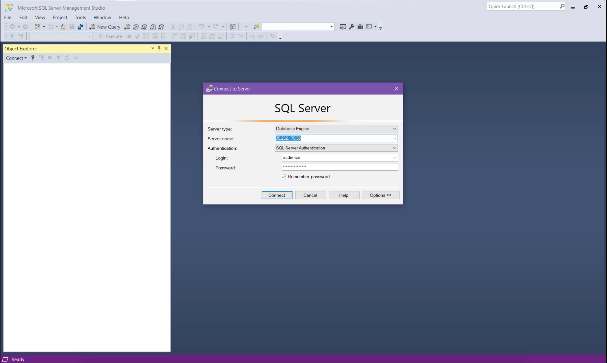
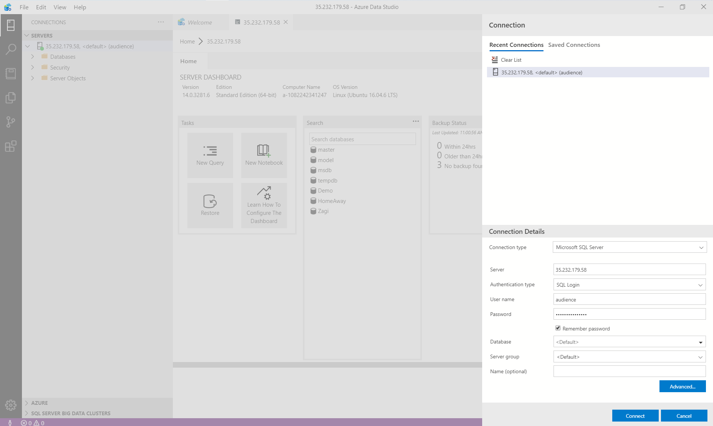

# :hammer: SPU Bootcamp of 2020 - SQL :tea::rainbow:

**Welcome** to Saint Peter's University (SPU) Bootcamp for 2020! 

During this bootcamp, session, you will learn more on Python, and SQL. Here, we will be looking into how we can utilize SQL in terms of business analytics and data science.

In this repository, you will find everything about SQL session of this bootcamp, along with presentations, and how-to guides. We will use this repository during the bootcamp as well, we will add answers or your discussions for your later use.

Following is the plan for the Bootcamp.

Time/ Slot           | Description
:------------------- | :-------------------------------
1 PM                 | Begining of the Bootcamp!
1 PM - 2 PM          | Knowledge refreshing session. We will go through database terms, relational model, and SQL. We will use Zagi, and Homeaway databases.
2 PM - 5 PM          | We will examine the Adventureworks database. Looking into questions about the database, we will write the SQL for them.
5 PM                 | End of Bootcamp.

Get ready, **fork this repository** to your GitHub account, if you don't have one, go ahead and create it. Use your fork of this repository as your **personal notes, edit your queries**, do anything! 

## Table of Contents

- [The Database for the Bootcamp](#the-database-for-the-bootcamp)
- [Queries](#queries)
- [Presentations](#presentations)
- [What are all these Files?](#what-are-all-these-files)

## The Database for the Bootcamp

During this Bootcamp, we will use Microsoft's SQL Server Express Edition database. Below, you will find guides to install it locally on your computer, depending on your operating system. 

However, for Bootcamp, we already set up a database for you to interact with it. Below you will find the information.

### Connecting to SQL Server from Azure

Thanks to **Dr. Gilkey**, we have a cloud database setup in SPU's Google cloud account to use during this Bootcamp. 

To connect to this database, you will use the following IP address. I will guide you what to do with this.

> 35.232.179.58

Cloud resources are highly protected and **you won't be able to access** to the database unless I **add your IP** to the safe list. Thats why your IP address needed to give you access to the server. Go ahead and type [what is my ip address?](https://www.google.com/search?q=what+is+my+ip+address) to Google and you will know your IP address! When I ask your IP addresses, this is the link to follow!

As a backup server, I have set up another server in case we have a problem with the main one. That server address is the following.

> bootcamp-2020.database.windows.net

Username and password will be provided during the bootcamp.

If all fails, we will going to install SQL Server Express Edition to our computers! No escape from here!

### Accessing to the Database

In order to access the database, we need either [SQL Server Management Studio (SSMS)](https://docs.microsoft.com/en-us/sql/ssms/download-sql-server-management-studio-ssms?view=sql-server-ver15) or [Azure Data Studio](https://docs.microsoft.com/en-us/sql/azure-data-studio/download-azure-data-studio?view=sql-server-ver15). 

You can go ahead and download these if you didn't download it already. Both mac users and windows users will be able to access the resources we have for this Bootcamp!

You can access to the database using SSMS in the following way.

Using with Azure Data Studio is like following.

<h3> Installing Database </h3>

#### SQL Server Express Edition Install Guide For Windows Users

Download and install the [SQL Server Express Edition](https://www.microsoft.com/en-us/sql-server/sql-server-downloads).

#### SQL Server Express Edition Install Guide For Mac Users

Installing a SQL server database to mac requires [docker](https://www.docker.com/) to be installed on your computer.

Follow instructions on [Quickstart: Run SQL Server container images with Docker](https://docs.microsoft.com/en-us/sql/linux/quickstart-install-connect-docker?view=sql-server-ver15&pivots=cs1-bash) page at Microsoft.

## Queries

We will go through with a lot of queries using AdventureWorks database. You can find more information about AdventureWorks database in [Microsoft's documentation page](https://docs.microsoft.com/en-us/sql/samples/adventureworks-install-configure?view=sql-server-ver15).

## Presentations

We will go through SQL syntax, relational database model and overview on data concepts.

## What are all these Files?

Following table is will give it a meaning for each file.

File                | Description 
-------             | ----------- 
README.md           | A descriptive file to give an introduction of the Bootcamp related information.
LICENCE             | The licence of the file that every project should have.
.gitignore          | The file to control which files should be ignored by Git.
.gitkeep            | An empty file to keep folders under git.
assets /            | The images used in this README file.
databases /         | The SQL queries we are using during presentations.
queries /           | The list of business questions we will find answers during Bootcamp, using SQL.
presentations /     | The list of presentations.
